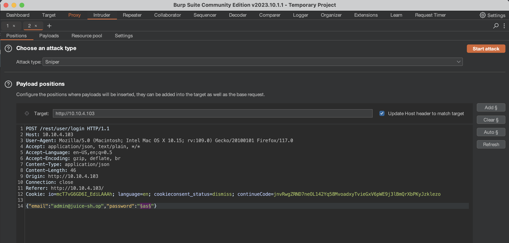
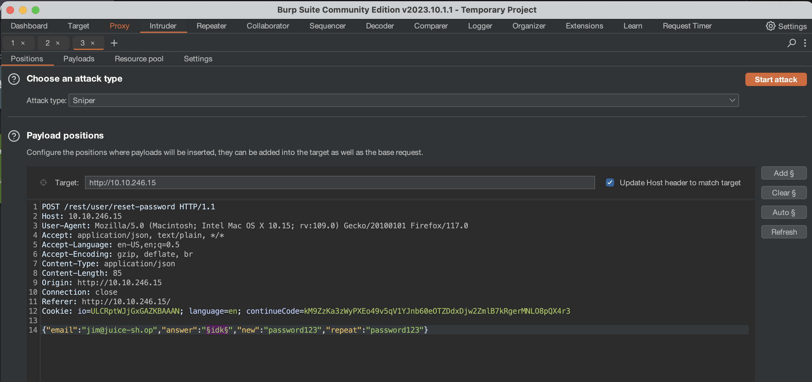

+++
title = 'CTF Writeup: OWASP Juice Shop'
date = 2023-09-22T01:58:01+08:00
draft = false
tags = ["CTF", "TryHackMe", "OWASP Top 10", "XSS", "Injection"]
+++

### Introduction
This [CTF](https://tryhackme.com/room/owaspjuiceshop) is called "OWASP Juice Shop" and is on the TryHackMe platform. It focuses on the following security concerns from the OWASP Top 10: Injection, Broken Authentication, Sensitive Data Exposure, Broken Access Control and Cross-Site Scripting (XSS). Let's get started.

### Task 1
This is simply spinning up the virtual machine and connecting to it through TryHackMe's VPN. It is recommended to be familiar with Burp. 

### Task 2
We do some basic reconnaissance: just walking the applicaion. We see that when we use the search in the navbar, the query parameter in the url is 'q'. We see that an admin left a comment on a product which exposed his email. We also see another user 'jim@juice-sh.op' left a comment which makes a reference to the show 'Star Trek'. 

Before moving on, I'm going to guess that we'll use the exposed admin's email as a target to gain higher privileges within the site. We'll probably use that reference to Star Trek to reset Jim's password if there's a security question asking about what the user's favorite show is in order to reset the password. 

### Task 3: Injection
This task is focused on injection, which is currently #3 on the OWASP Top 10 (2021).

Let's head to the login page and turn on Burp Proxy to see what's getting sent to server. It uses 'email' and 'password' body parameters in the HTTP request. We change the email input to `' or 1=1--`, forward the request in Burp which then logs us in as the admin. 

Why? 

Because the first apostrophe closes the brackets in the SQL query (this was the query, which we grabbed from the response: `SELECT * FROM Users WHERE email = '{CLIENT-INPUT}' AND password = '{CLIENT-INPUT}' AND deletedAt IS NULL`). Then 1=1 forces the query to be true and -- comments everything else after out. The admin account was the first result returned from query, which is why that enabled us to login as admin. 

After sending the payload we get the first flag for this task: **32a5e0f21372bcc1000a6088b93b458e41f0e02a**

The second sub-task is to login to a specific account with the email `bender@juice-sh.op`. Similar to previous injection, if we just enter `bender@juice-sh.op' --` into the email parameter, we can login without needing to know password since the query just returns rows from the database that match the email only. The effective query sent to the database would `SELECT * FROM Users WHERE email = bender@juice-sh.op`.

To sum up this task, we're using basic SQL injections to bypass authentication. 

### Task 4: Broken Authentication
This task also exploits authentication via common vulnerabilities: weak passwords and forgotten password pages. 

First we're going to try to bruteforce the password for the admin account. Let's capture the login request again in Burp, then forward it to the Intruder module, which allows us to select a parameter in a HTTP request, then fuzz it with a custom [wordlist](https://github.com/danielmiessler/SecLists/blob/master/Passwords/Common-Credentials/best1050.txt). 

Notice that attack type is "Sniper". This is because we're only fuzzing one parameter. The other options have to do with multiple parameters and how we fuzz them (see [here](https://portswigger.net/burp/documentation/desktop/tools/intruder/configure-attack/attack-types) for more info).

We've highlighted the password parameter (our target) then went to the payloads tab where we'll load our wordlist. Now, we start the attack.

We can view which input worked by looking at returned status code and/or length of the returned responses. The one that is unique will be the one we want look at since that's the one that was able to login.

After a few minutes of letting that run, it found that the password `admin123` returned a status code of 200. Success!

_Note: we can also use [thc-hydra](https://github.com/vanhauser-thc/thc-hydra) to brute force a variety of web services._

<!-- Just for fun, I want to try and brute force the login with hydra with the following command:  -->

<!-- `hydra -l admin -P ~/thm-ws/rooms/owaspjuiceshop/best1050.txt -t 64 -V 10.10.4.103 http-post-form "/rest/user/login:email=admin@juice-sh.op&password=^PASS^:Invalid email or password."`

This command essentially works the same way as Burp Intruder Sniper Attack except for how we're able to tell when we've found a valid password. In hydra, we can enter a string that determines an unsuccessful attempt, if it's found the response. In this case, it's "Invalid email or password." which I was able to find my just attempting a login with junk values. Versus with Burp Intruder where we had to look at the characteristics of the response (code and length).

`-t 64` creates 64 threads and `-V` shows each login attempt. -->

The second subtask, we're trying to log into jim's account. Using the comment he made about Star Trek, we can guess his password reset security question with a little bit of OSINT. His brother's name, Samuel, is James Kirk's brother's middle name in the show. This allows us to reset the password.

Personally, this seems a bit too convienent and unrealistic although I understand the point of the exercise: any information at all on our target can be useful and be creative as to how we can exploit our target with seemingly worthless information; enumerate all possibilties even if they seem like nothing helpful (at first). 

However, say we didn't have that comment about Star Trek. We could easily brute force this using Burp Intruder as well. We can just capture the request that resets the password and use a wordlist of names to crack it. This should be much quicker than bruteforcing a password since names don't have numbers, special characters and are not "random". 

I did a demo of it using a very short list of 5 names since I already know the correct answer but we could've easily used a name wordlist if we didn't know it.

### Task 5: Sensitive Data Exposure

_Note: Sensitive Data Exposure is now classified under "Cryptographic Failures" in the OWASP Top 10 2021. However, this task relates more to "Broken Access Control" than "Cryptographic Failures"._

When we with think about sensitive data exposure, we might initially just think about users' sensitive data, like their address, email, phone number, etc. But we should think about sensitive information left available by developers which is often caused by broken access control, or a lack of access control.

For the first part of this task, there's link in their terms of serivce: `/ftp/legal.md`. However, we are able to enter the `/ftp` directory where a suite of files are available to download that shouldn't be. By downloading the legal.md file, we get the first flag.

The second part of this task is reminder not to leak any clues about your password in conversation or in passing. The example they give is a rapper who mentions his password. Seems a bit unrealistic again, however I get the point they're making. Your password must be kept a secret. And a secret is not a secret if you talk about it!

In the third subtask, we're supposed to download the `package.json.bak` file. However a 403 error is returned, telling us we can only download .md and .pdf files. We can bypass this by using a "Poison Null Byte". Null bytes are used in languages to signal the end of a string instead of the first byte of the string denoting the length. Null bytes can be used in attacks such as a directory traversal by nulling the rest of string. 

Here's an example:

    `$file = $_GET['file'];` 
    `require_once("/var/www/$file.php");` 

The above php code attempts to enforce that the file entered ends with the .php file extension. Here's a payload to load the /etc/passwd file:  `http://www.example.com/index.php?file=../../etc/passwd%00`. Notice how the null byte will null the `.php` extension in the second line of php code.

Back to the CTF, we can bypass the access control by adding crafting the following url: `http://10.10.156.165/ftp/package.json.bak%2500.md`. The application initially thinks this is a valid file because it ends with .md, however it gets processed as `package.json.bak` due to the null byte. We run `wget http://10.10.156.165/ftp/package.json.bak%2500.md` to get the final flag. 

### Task 6: Broken Access Control

By doing some reconnaissance on one of loaded .js files, `main-es2015.js`, we can see there's a `/#/administration` page. It returns a 403 error if we attempt to load it without being logged in as admin. But once we login as admin (we already know the password), we get the the first flag for this task. 

For the next flag, we can view another user's basket by changing request line from `GET /rest/basket/1 HTTP/1.1` to `GET /rest/basket/2 HTTP/1.1`, which now sends a request to the server asking for the basket of the user with an ID of 2. This gets us the second flag. This kind type of vulnerability is called a "Insecure direct object reference", or IDOR. 

For the third flag, we just remove all the five stars by going back to the `/#/administration` page logged in as admin.

### Task 7: Cross-site Scriping (XSS)

_Note: XSS is now under the category of "Injection" for OWASP Top 10 2021._

There are 3 main types of XSS attacks: DOM (Special), Persistent (Server-side), Reflected (Client-side).

- DOM XSS uses the HTML environment to execute malicious javascript. This type of attack commonly uses the \ HTML tag.
- Persistent XSS is javascript that is run when the server loads the page containing it. These can occur when the server does not sanitize the user data when it is uploaded to a page. These are commonly found on blog posts. 
- Reflected XSS is javascript that is run on the client-side end of the web application. These are most commonly found when the server doesn't sanitize search data. 

For the first subtask, we'll perform a DOM XSS attack by entering `<iframe src="javascript:alert('xss')">` into the search bar, giving us the first flag. This is also known as XFS, or Cross Frame Scripting.

For part 2, we'll execute a persistent XSS attack. The application has a feature that stores the last IP login. So we'll logout but capture the request in Burp before forwarding it. Then we add a new header `True-Client-IP: <iframe src="javascript:alert('xss')">` so the server stores the account's last login IP as the iframe tag. When we log back in and view our last login IP, the XSS alert pops up, confirming the success of our persistent XSS attack and giving us the flag.

Next we perform a reflected XSS attack. We do this by replacing the `id` parameter of order in the tracking page with our iframe payload again. But first, we change the payload to URL encoding: `%3Ciframe%20src%3D%22javascript%3Aalert%28%60xss%60%29%22%3E`. This gets us the final flag.

The CTF is now completed.

### Conclusion

This CTF was really more of a walk through. There was a lot of material covered but it didn't go into depth for any of topics. I'd say this room is good if you're brand new to web app security or as a quick refresher but you can definitely skip it if you have any experience in CTFs or have any type of pentesting certificate.
